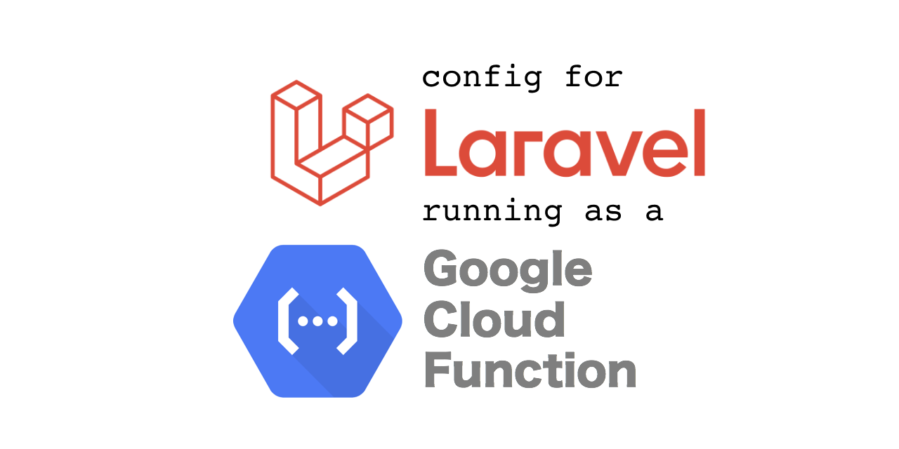

<p align="center">
<a href="https://packagist.org/packages/rverrips/laravel-google-cloud-function-config"></a>
<a href="https://packagist.org/packages/rverrips/laravel-google-cloud-function-config"></a>
<a href="https://packagist.org/packages/rverrips/laravel-google-cloud-function-config"></a>
</p>

Last substantial update in ***September 2021*** / Laravel 8 / PHP 7.4 / Google Cloud Function Framework 0.7

Basic Configuration for running Laravel as a native php Google Cloud Function

*Highly inspired by and with special thanks to the [Bref Service Provider](https://github.com/brefphp/laravel-bridge/blob/master/src/BrefServiceProvider.php)*

# Installation
1. For local testing and deployment install [Google Cloud SDK](https://cloud.google.com/sdk/docs/install)

Might be as simple as:
```bash
:~$ brew install google-cloud-sdk
```

2. Locally install new [Laravel Application](https://laravel.com/docs/8.x/installation#the-laravel-installer)

Should be as simple as:
```bash
:~$ cd ~/code
:~/code$ laravel new laravel-gcf

##(Installation details here)##

:~/code$ cd laravel-gcf
:~/code/laravel-gcf$
```

3. Add this package
```bash
:~/code/laravel-gcf$ composer require rverrips/laravel-google-cloud-function-config
```

4. Publish the assets (index.php and .gcloudingnore into root of project)
```bash
:~/code/laravel-gcf$ php artisan vendor:publish 'gcf-config'
```

# Local Testing
1. Optional: Add local startup to composer.json scripts

(before)
````json
    "scripts": {
        "post-autoload-dump": [
            "Illuminate\\Foundation\\ComposerScripts::postAutoloadDump",
            "@php artisan package:discover --ansi"
        ],
        "post-update-cmd": [
            "@php artisan vendor:publish --tag=laravel-assets --ansi"
        ],
        "post-root-package-install": [
            "@php -r \"file_exists('.env') || copy('.env.example', '.env');\""
        ],
        "post-create-project-cmd": [
            "@php artisan key:generate --ansi"
        ]
    },
````

(after)

```json
    "scripts": {
        "start": [
            "Composer\\Config::disableProcessTimeout",
            "FUNCTION_TARGET=laravel php -S localhost:${PORT:-8080} vendor/bin/router.php"
        ],
        "post-autoload-dump": [
            "Illuminate\\Foundation\\ComposerScripts::postAutoloadDump",
            "@php artisan package:discover --ansi"
        ],
        "post-update-cmd": [
            "@php artisan vendor:publish --tag=laravel-assets --ansi"
        ],
        "post-root-package-install": [
            "@php -r \"file_exists('.env') || copy('.env.example', '.env');\""
        ],
        "post-create-project-cmd": [
            "@php artisan key:generate --ansi"
        ]
    },
```

2. Test locally with the [Google Cloud Function PHP runtime](https://cloud.google.com/functions/docs/running/function-frameworks#functions-local-ff-configure-php)
```bash
:~/code/laravel-gcf$ composer start
```
or if you did not update your composer.json
```bash
:~/code/laravel-gcf$ export FUNCTION_TARGET=YOUR_FUNCTION_NAME
:~/code/laravel-gcf$ php -S localhost:8080 vendor/bin/router.php
```
You should see Laravel running on http://localhost:8080 being served by the GCF runtime.  (Ctrl-C to end/exit)

# Environment Setup

It is highly recommend that you setup an ENV.YML file which will set your runtime environment variables in the Google Cloud (using .env will not suffice).  Remember also that the Google Cloud function does not persist any data, so if you require any file cache, session caching to files, logfiles etc. to be shared across deployed functions you will need to map a Google Storage location. (Currently outside the scope of this README.md).

The **GoogleCloudFunctionConfigServiceProvider** is basically a set of *working defaults for GCF* - It works, maybe not the best, but it works.

At a minimum it's recommend to set the APP_KEY as a runtime the Environment Variable.

Note that ENV.YML file syntax would be something like APP_KEY: "base64:/abc123....123abcs="  (colon, not equals like in .env)

# Deployment

1. Login to Google Cloud SDK:
```bash
:~/code/laravel-gcf$ gcloud auth login
```
(This will open a browser to set the Google account to use)

2. Set the Project to deploy the Cloud Function into:
```bash
:~/code/laravel-gcf$ gcloud config set project ##YOUR PROJECT##
```

3. Deploy the Cloud Function
```bash
:~/code/laravel-gcf$ gcloud functions deploy ##YOUR FUNCTION NAME## --runtime php74 --allow-unauthenticated --trigger-http --env-vars-file env.yml --entry-point=laravel
```

4. Test Deployment
Deployment should take about 2 minutes.

Assuming no errors, you can now view your laravel app at the specified location in the deployment trigger.

Usually something like https://us-central1-YOUR_PROJECT.cloudfunctions.net/YOUR_FUNCTION

Note: This is still very much Alpha Code / PRs and Updates to the Docs welcome.

# License

This package is open-sourced software licensed under the [MIT license](https://opensource.org/licenses/MIT).
